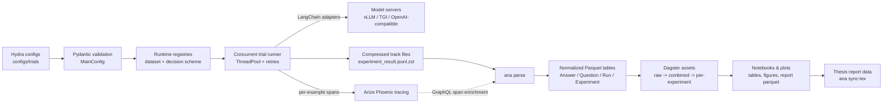
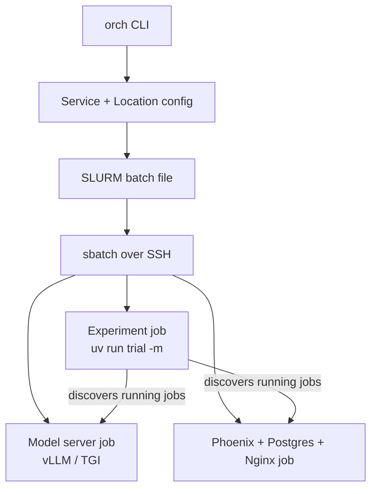
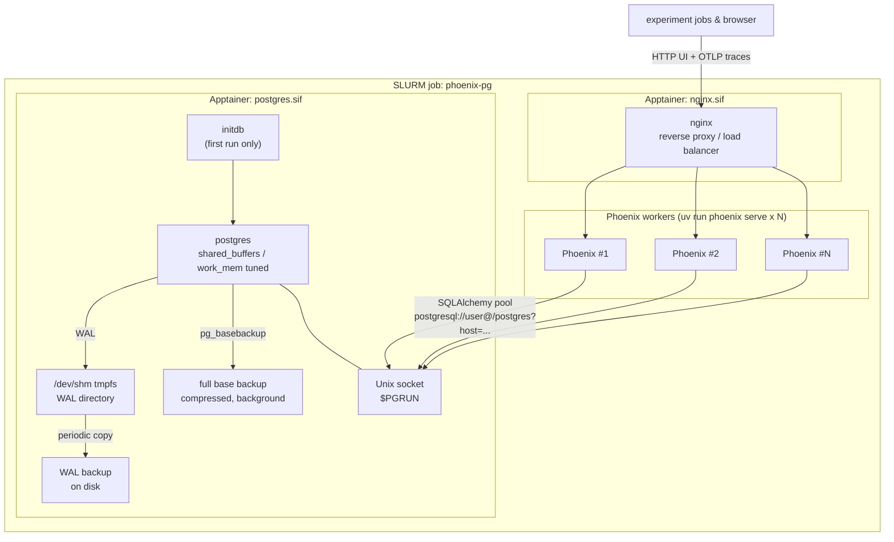

<p align="center">
  
</p>

<p align="center">
  
  
  
  
  
</p>

<p align="center">
  
  
  
  
  
</p>

<p align="center">
  
  
  
  
  
</p>

# Social Groups Experiment Framework

A research codebase built for a Master's thesis on **group decision-making with large language models**: how single
agents, majority voting, and multi-agent debate variants compare when several LLMs (of the same or different model
families) have to agree on an answer to a hard multiple-choice question.

The repository is not a collection of notebooks — it is a full experiment pipeline: typed configuration, distributed
execution on a SLURM cluster, per-example tracing, a normalized analytical data model, and a Dagster-orchestrated
reporting layer that feeds figures and tables directly into the thesis document.

## At a Glance

|                     |                                                                                                                          |
|---------------------|--------------------------------------------------------------------------------------------------------------------------|
| Source code         | **15.6k** lines of Python across **171** files, organized into 7 packages                                                |
| Decision strategies | **10** registered schemes: single-agent, tool-use, structured output, majority voting, and 6 multi-agent-debate variants |
| Benchmarks          | MMLU-Pro (5 slice variants) and GPQA-Diamond, via **6** dataset connectors                                               |
| Experiment configs  | **80** Hydra configurations under `configs/trials/experiment/final*`, spanning **25** distinct experiment families       |
| Executed runs       | **1,780** parsed experiment runs, **2,603** compressed trace files on disk                                               |
| LLM calls           | **~5 million** LLM calls across the final experiments                                                                    |
| Cluster targets     | 2 SLURM locations, 5 orchestrated service types (experiment, vLLM, TGI, Phoenix, Phoenix+Postgres)                       |
| Project span        | ~8 months of active development, 296+ commits                                                                            |

All numbers above are measured directly from the current repository and its generated `results/` data, not estimated.

## System Overview

The pipeline runs end-to-end from a declarative experiment definition to a thesis-ready figure:



Cluster execution adds one layer in front of this: the `orch` CLI turns typed service configs into SLURM batch jobs,
discovers already-running model servers and Phoenix instances over SSH, and injects their endpoints into the experiment
job it submits.



A more detailed, appendix-scale version of the full architecture — including asset checks, notebook materialization, and
the Streamlit inspection tool — is kept as diagram source at `assets/information/system_architecture.mmd`.

### Self-Hosted Phoenix + PostgreSQL

`J2` above is its own small piece of infrastructure: the `phoenix-pg` service
([`orchestrator/services/phoenix_pg.py`](src/social_groups/orchestrator/services/phoenix_pg.py)) runs Arize Phoenix
against a self-managed PostgreSQL instance instead of Phoenix's default SQLite store, so several Phoenix processes can
share one database under concurrent experiment load. Postgres, the Phoenix workers, and an NGINX reverse proxy each
run in their own Apptainer container, all inside a single SLURM job.



- Postgres's data directory persists on disk; WAL is redirected to a `/dev/shm` tmpfs for low-latency commits and
  copied back to disk on every backup, so a crash loses at most what's still sitting in the tmpfs.
- On first start the container runs `initdb`; later starts reuse the existing `$PGDATA` and just replay the WAL.
- Once Postgres reports ready, `pg_basebackup` takes a fresh full backup in the background before Phoenix boots.
- Several Phoenix processes (one per configured port) share the same Postgres instance over a Unix socket, pooled via
  SQLAlchemy (`PHOENIX_SQLALCHEMY_POOL_SIZE` / `MAX_OVERFLOW`), and sit behind an NGINX container that load-balances
  the UI and OTLP trace ingestion behind a single external port.
- An `EXIT`/`SIGTERM`/`SIGINT` trap tears everything down in dependency order — Phoenix, then NGINX, then Postgres —
  taking a final WAL backup so a re-submitted job can resume cleanly.

## Repository Layout

```text
assets/
  information/        Generated architecture diagrams and data-overview artifacts
  orchestration/       NGINX config and Apptainer image locations used by orchestration
  scripts/              Convenience scripts for starting groups of cluster jobs
configs/
  orchestration/       Per-location service configs for the pascal and neumann clusters
  trials/               Hydra configs for experiment runs and sweeps (experiment/final, final_gemma, hetero, tribal, test)
notebooks/             Exploratory notebooks and scratch analysis
src/social_groups/     Python package (see table below)
results/               Generated experiment, Phoenix, analysis, and report outputs (not source-of-truth)
```

## Source Packages

| Package                                                    | Purpose                                                                                                                                     |
|------------------------------------------------------------|---------------------------------------------------------------------------------------------------------------------------------------------|
| [`trialrunner`](src/social_groups/trialrunner/README.md)   | Runs Hydra-configured experiments: dataset iteration, decision-scheme execution, retries, and Phoenix-traced track files.                   |
| [`orchestrator`](src/social_groups/orchestrator/README.md) | Turns typed service configs into SLURM jobs; starts, inspects, pipes, and syncs model servers, tracing infrastructure, and experiment jobs. |
| [`analyzer`](src/social_groups/analyzer/README.md)         | Converts compressed experiment tracks plus Phoenix span data into normalized Parquet tables.                                                |
| [`analysis`](src/social_groups/analysis/README.md)         | The Dagster project: raw/combined/per-experiment assets, asset checks, and notebook-driven report materialization.                          |
| [`reporting`](src/social_groups/reporting/README.md)       | Answer parsing, group-vote aggregation, comparison logic, and the Matplotlib/Seaborn/Plotly plotting library used by every figure.          |
| [`tools`](src/social_groups/tools/README.md)               | Streamlit utilities for manually inspecting generated track files.                                                                          |
| [`general`](src/social_groups/general/README.md)           | Shared tracking, SSH/subprocess command helpers, and the registry pattern used by connectors, schemes, and services.                        |

Each package ships its own `README.md` with module-level detail; the table above is the entry point.

## Decision Schemes & Datasets

Ten decision strategies are registered in `trialrunner/decision_schemes` and selected purely through configuration:

| Strategy                                             | Idea                                                                                 |
|------------------------------------------------------|--------------------------------------------------------------------------------------|
| `single-agent` / `-tool` / `-structured-output`      | One model answers directly, optionally with tool access or forced structured output. |
| `multi-agent-debate` / `custom-multi-agent-debate`   | Several agents exchange reasoning over multiple rounds before a final vote.          |
| `changed_prompt_mad` / `changed_prompt_thinking_mad` | Debate variants that probe prompt-order and visible-thinking effects.                |
| `thinking-mad`                                       | Debate with explicit reasoning traces exposed between agents.                        |
| `tribal-council`                                     | A structured elimination-style multi-round group discussion format.                  |
| `encouraging-divergent-thinking`                     | A scheme designed to counter premature consensus in group debate.                    |

Benchmarks are pluggable through `trialrunner/data_connectors`: **MMLU-Pro** (full set plus
subset/medium-subset/big-subset/single-question slices) and **GPQA-Diamond**.

## Installation

The project is a Python 3.11 package managed with [`uv`](https://docs.astral.sh/uv/).

```shell
uv sync
```

Console scripts are exposed through `pyproject.toml` and should be run with `uv run`.

## Command Reference

| Command                                                  | Defined by     | Purpose                                                                         |
|----------------------------------------------------------|----------------|---------------------------------------------------------------------------------|
| `uv run trial ...`                                       | `trialrunner`  | Run a Hydra experiment locally or inside a cluster job.                         |
| `uv run orch start <location> <service>`                 | `orchestrator` | Submit a SLURM job for `experiment`, `phoenix`, `phoenix-pg`, `tgi`, or `vllm`. |
| `uv run orch show / stop / log / pipe / sync <location>` | `orchestrator` | Inspect, cancel, tail logs for, forward, or sync remote SLURM jobs and results. |
| `uv run ana parse`                                       | `analyzer`     | Build normalized Parquet tables from final run outputs and Phoenix spans.       |
| `uv run ana sync-tex`                                    | `analyzer`     | Sync generated Dagster report assets into the adjacent thesis project.          |
| `uv run task dagster`                                    | `taskipy`      | Start the Dagster UI (`DAGSTER_HOME=.tmp_dagster`).                             |
| `uv run task tools`                                      | `taskipy`      | Start the Streamlit track-file viewer.                                          |

### Run an experiment locally

```shell
uv run trial --config-dir configs/trials --config-name local +experiment=standard
```

### Drive cluster infrastructure

```shell
uv run orch start neumann phoenix-pg
uv run orch start neumann vllm --llm Qwen/Qwen3-4B
uv run orch start neumann experiment -m -e final/baseline
```

The experiment service discovers the already-running Phoenix and model-server jobs and injects their endpoints into the
submitted `trial` command.

### Parse and build report assets

```shell
uv run ana parse       # results/runs|multirun/final -> results/analysis/parquet/*.parquet
uv run task dagster    # Parquet -> combined/per-experiment assets -> notebooks -> report figures
uv run ana sync-tex    # copy results/analysis/dagster/report into the thesis project
```

## Data Model

`ana parse` produces four normalized tables that everything downstream is built on:

| Table        | Rows (current data) | Content                                                         |
|--------------|---------------------|-----------------------------------------------------------------|
| `Question`   | 1,498               | Dataset source, category, question text, options, target answer |
| `Run`        | 1,780               | Resolved experiment/execution configuration and run metadata    |
| `Experiment` | 25                  | Experiment id/name grouping runs into comparable families       |

## Development Notes

- New decision schemes go in `trialrunner/decision_schemes`, registered with `@register_decision_scheme(...)`.
- New datasets go in `trialrunner/data_connectors`, registered with `@register_data_connector(...)`.
- New cluster services subclass `SlurmService` and register with `@register_slurm_service(...)`.
- Analysis code writes generated artifacts to `results/analysis`, never into source directories.
- Shared Polars column/value constants live in `src/social_groups/polars_columns.py` and `polars_values.py`.
